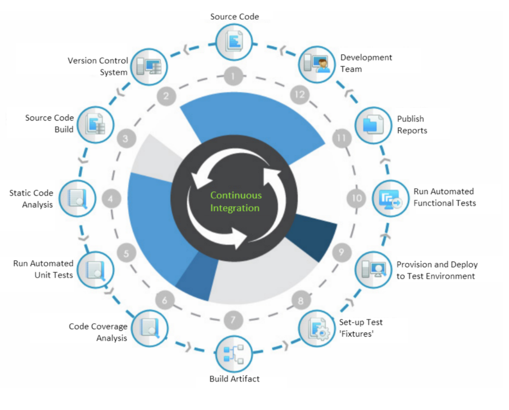

# CI

> [!IMPORTANT]  
> **Goal:** Create CI in local machine

Steps

- CI of service API
- CI of frontend web



sck-online-store:
<https://github.com/SCK-SEAL-TEAM-One/sck-online-store>

## CI of service API

### Start point database

Run command

```sh
docker compose up db -d
```

Checking database work, you can connect database by ui database client or commandline

> Check databse work by command line (optional)
>
> Exec to datababase container then
>
> ```sh
> mysql -u user -p
> ```
>
> After that, select a database to work with
>
> ```sh
> use point;
> ```
>
> And finally, display all tables in the current database
>
> ```sh
> show tables;
> ```
>
Go to point-service directory

```sh
cd point-service
```

### Start point api

Go to point-service directory

```sh
cd point-service
```

Install package dependancies

```sh
npm install
```

Install package dependancies

```sh
npm run start:dev
```

Go to <http://localhost:8001/api/v1/point> or <http://localhost:8001/api/v1/hello>

### Unit test for point-service

Run command

```sh
npm run test
```

Edit `src/hello/hello.service.ts` and run test again

Run unit test with coverage

```sh
npm run test:cov
```

Comment some of test cases in `src/point/test/point.service.spec.ts`, run test coverage and check the report again

### API test

Create postman collection and environment

Generate test and edit `src/hello/hello.service.ts` or `src/point/point.entity.ts` and run test again

You can run all test case by postman gui or script

#### Run api test by script

Install newman cli

```sh
npm install -g newman
```

Run newman cli

```sh
newman run ../atdd/api/workshop.postman_collection.json -e ../atdd/api/workshop.postman_environment.json
```

Install newman reporter

```sh
npm install -g newman-reporter-htmlextra
```

Run newman cli again

```sh
newman run ../atdd/api/workshop.postman_collection.json -e ../atdd/api/workshop.postman_environment.json -r cli,junit,htmlextra
```

### Running all test (local)

- Run unit test
- Setup test fixtures
- Start application (docker)
- Run api test

Update `Makefile`, add this code

```sh
point_all:
    cd point-service && npm run test
    docker compose up db -d
    docker compose up point-service -d --build
    newman run atdd/api/workshop.postman_collection.json -e atdd/api/workshop.postman_environment.json -r cli,junit,htmlextra
    docker compose down db point-service
    echo "All done"
```

Back to sck-online-store root directory and run command

```sh
make point_all
```

## Third party API

### Stub api

Run command

```sh
docker compose up thirdparty -d
```

Checking bank api: <http://localhost:8882/card/information>

Checking shipping api:

```sh
curl --location 'http://localhost:8883/shipping' \
  --header 'Content-Type: application/json' \
  --data '{
      "shipping_method_id": 1
  }'
```

---

### Try mountebank cli

Install

```sh
npm install -g mountebank
```

Create `imposter.json` in `thirdparty/workshop` directory

```sh
{
  "port": 8880,
  "protocol": "http",
  "stubs": [
    {
      "predicates": [
        {
          "equals": {
            "method": "GET",
            "path": "/sample/users"
          }
        }
      ],
      "responses": [
        {
          "is": {
            "statusCode": 200,
            "headers": { "Content-Types": "application/json" },
            "body": [
              {
                "id": 1,
                "name": "John",
                "age": 36
              },
              {
                "id": 2,
                "name": "Jane",
                "age": 36
              }
            ]
          }
        }
      ]
    }
  ]
}
```

Run with imposter file

```sh
mb start --configfile thirdparty/workshop/imposter.json
```

Go to <http://localhost:8880/sample/users>

#### Swich response

Update `imposter.json`, add code (after line 32)

```sh
{
  "is": {
    "statusCode": 404,
    "headers": { "Content-Types": "application/json" },
    "body": {
      "message": "Not found"
    }
  }
}
```

Run and call twice and check the result

#### Post method

Update `imposter.json`, add code (after line 43)

```sh
{
  "predicates": [
    {
      "equals": {
        "method": "POST"
      }
    },
    {
      "equals": {
        "path": "/sample/users"
      }
    },
    {
      "jsonpath": { "selector": "$.name" },
      "caseSensitive": true,
      "equals": { "body": "Meng" }
    },
    {
      "jsonpath": { "selector": "$.age" },
      "equals": { "body": 34 }
    }
  ],
  "responses": [
    {
      "is": {
        "statusCode": 201,
        "headers": { "Content-Types": "application/json" },
        "body": {
          "message": "Success"
        }
      }
    }
  ]
}
```

Check

```sh
curl --location 'http://localhost:8880/sample/users' \
--header 'Content-Type: application/json' \
--data '{
    "name": "Meng",
    "age": 34
}'
```

#### Default response

Update `imposter.json`, add code (after line 3)

```sh
"defaultResponse": {
  "statusCode": 400,
  "headers": {
    "Connection": "Keep-Alive",
    "Content-Length": 0
  }
},
```

#### Delay

Update `imposter.json`, add code (after line 47)

```sh
"_behaviors": {
  "wait": 3000
}
```

## CI of frontend web

Go to store-web directory

```sh
cd store-web
```

### Unit test for store-web

Run command

```sh
npm run cy:open
```

or

```sh
npm run cy:run
```

### linter

Run command

```sh
npm run lint
```

You can edit indent any line of code and run again

### Ui test

#### Setup test fixture

Start api and web with docker

Back to sck-online-store root directory and run command

```sh
docker compose up -d thirdparty db point-service store-service store-web nginx --build
```

#### Run ui test

```sh
cd atdd/ui \
&& python3 -m venv .venv \
&& . .venv/bin/activate \
&& pip install -r requirements.txt \
&& robot -v URL:http://localhost/product/list . \
&& deactivate && cd ../..
```

> Run robot by open chrome (optional)
>
> ```sh
> cd atdd/ui \
> && python3 -m venv .venv \
> && . .venv/bin/activate \
> && pip install -r requirements.txt \
> && robot -v URL:http://localhost/product/list -v BROWSER:chrome . \
> && deactivate && cd ../..
> ```

### Running all test for web (local)

- Run unit test
- Run code analysis
- Setup test fixtures
- Start application (docker)
- Run ui test

Update `Makefile`, add this code

```sh
web_all:
    cd store-web && npm run cy:run
    cd store-web && npm run lint
    docker compose up thirdparty db point-service store-service nginx -d
    docker compose up store-web -d --build
    cd atdd/ui \
      && python3 -m venv .venv \
      && . .venv/bin/activate \
      && pip install -r requirements.txt \
      && robot -v URL:http://localhost/product/list . \
      && deactivate && cd ../..
    docker compose down thirdparty db point-service store-service store-web
    echo "All done"
```
