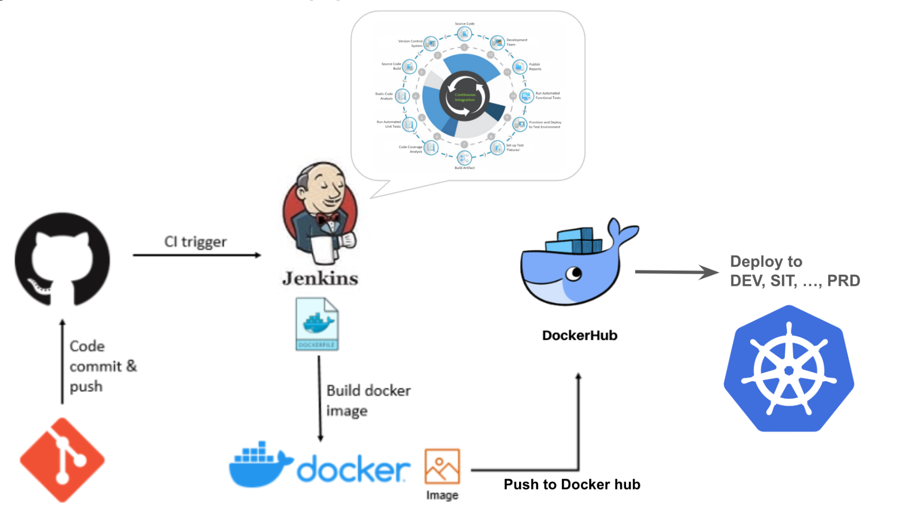
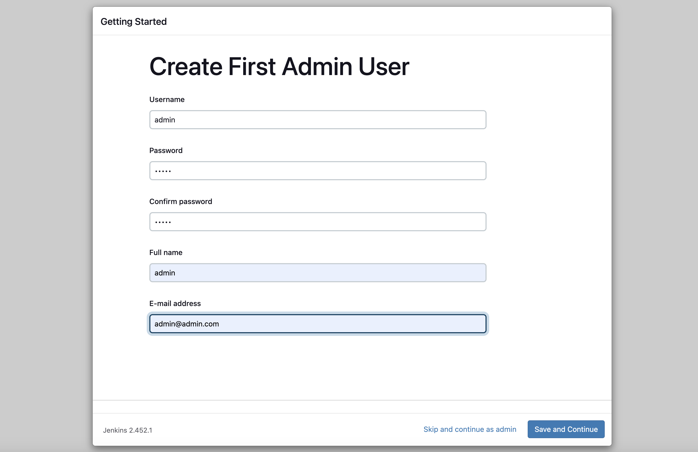
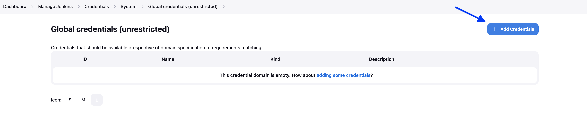
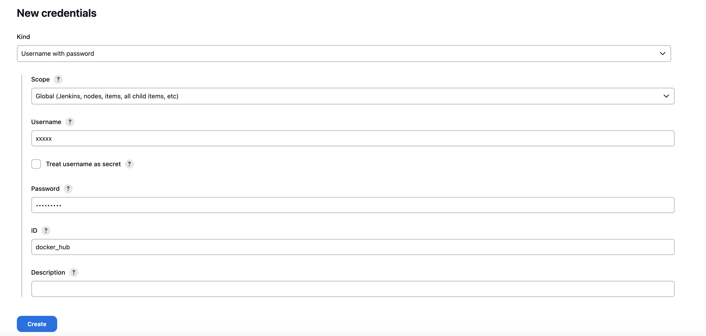
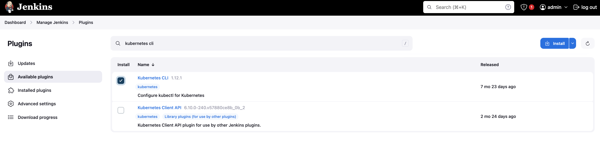
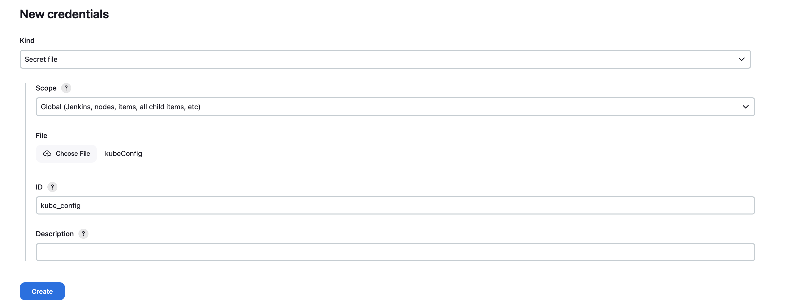

# CI/CD Pipeline

> [!IMPORTANT]  
> **Goal:** Create CI/CD pipeline with Jenkins

Steps

1. Running Jenkins
2. Setup jenkins
3. Setup pipeline & create ci
4. Create cd (Add deployment to pipeline)
5. Checking results



---

## 1. Running Jenkins in machine

Install Jenkins depend your OS machine: <https://www.jenkins.io/doc/book/installing/macos/>

Start Jenkins: Go to <http://localhost:8080>

input password and choosing install suggested plugin, then waiting a moment

Filling username, password, full name and email


Setting Jenkins URL: `http://localhost:8080/` (by default)

Then start jenkins

## 2. Setup jenkins

### 2.1 Add docker hub credential

Go to <http://localhost:8080/manage/credentials/store/system/domain/_/>

Click `Add credential` button


- Kind: Username with password
- Scope: Global
- Username: `YOUR_DOCKER_HUB_USER`
- Password: `YOUR_DOCKER_HUB_PASSWORD`
- ID: docker_hub
- Description: docker hub



---

### 2.2 Add jenkins plugins for kubernetes

Manage Jenkins > Plugins > Available plugins > search `kubernetes CLI` > checked and install



And also install plugin `Pipeline: Stage View` and `HTML Publisher`

## 3. Setup pipeline & create ci

### 3.1 create ci

On first page click `+ New Item` menu

Enter pipeline name for example `demo_pipeline`

Click Pipeline option and submit

then input code to pipeline script

```sh
pipeline {
  agent any

  stages {
    stage('Checkout code') {
      steps {
        git branch: 'workshop', url: 'https://github.com/SCK-SEAL-TEAM-One/sck-online-store.git'
      }
    }
    
    stage('install dependency') {
      steps {
        sh 'echo install dependency'
      }
    }
    stage('code analysis') {
      steps {
        sh 'echo code analysis'
      }
    }
    stage('unit test') {
      steps {
        sh 'echo unit test'
      }
    }
    stage('setup test fixtures') {
      steps {
        sh 'echo setup test fixtures'
      }
    }
    stage('setup & provision') {
      steps {
        sh 'echo setup provision'
      }
    }
    stage('run ATDD') {
      steps {
        sh 'echo run ATDD'
      }
    }
  }
  post {
    always {
      sh 'docker compose down'
      sh 'docker volume prune -f'
    }
  }
}
```

#### Workshop ci

- Update ci pipeline for service api
- Update ci pipeline for web frontend

### 3.2 Report

Go to "pipeline Syntax" menu and select `publishHTML: Publish HTML Reports`, input your report

Some report cannot open need to config script

Manage Jenkins > Script Console

```sh
System.setProperty("hudson.model.DirectoryBrowserSupport.CSP","sandbox allow-scripts; default-src 'none'; img-src 'self' data: ; style-src 'self' 'unsafe-inline' data: ; script-src 'self' 'unsafe-inline' 'unsafe-eval' ;")
```

#### Coverage report

Download plugin <https://plugins.jenkins.io/clover/>

### 3.3 Push image to registry

Update pipeline: add this stage

```sh
    stage('Push Docker Image to Docker Hub') {
      steps {
        withCredentials([usernamePassword(credentialsId: 'docker_hub', passwordVariable: 'DOCKER_PASS', usernameVariable: 'DOCKER_USER')]) {
          sh 'docker login -u $DOCKER_USER -p $DOCKER_PASS'
          sh 'docker image tag point-service:0.0.1 $DOCKER_USER/point-service:$BUILD_NUMBER'
          sh 'docker image tag store-service:0.0.1 $DOCKER_USER/store-service:$BUILD_NUMBER'
          sh 'docker image tag store-web:0.1.0 $DOCKER_USER/store-web:$BUILD_NUMBER'
          sh 'docker image push $DOCKER_USER/point-service:$BUILD_NUMBER'
          sh 'docker image push $DOCKER_USER/store-service:$BUILD_NUMBER'
          sh 'docker image push $DOCKER_USER/store-web:$BUILD_NUMBER'
        }        
      }
    } 
```

## 4 Add deployment to pipeline

### 4.1 Setup dependancies system

Initial database as production database

```sh
docker run --name mysql-prod \
  -e MYSQL_ROOT_PASSWORD=root \
  -e MYSQL_USER=user \
  -e MYSQL_PASSWORD=password \
  -v ./tearup/point/init.sql:/docker-entrypoint-initdb.d/point.sql \
  -v ./tearup/store/init.sql:/docker-entrypoint-initdb.d/store.sql \
  -v ./tearup/grandall.sql:/docker-entrypoint-initdb.d/grandall.sql \
  -p 3308:3306 -d mysql:8.3.0
```

### 4.2 Setup Cluster

Create new cluster

```sh
k3d cluster create my-cluster --servers 1 --agents 1 --port "8888:80@loadbalancer"
```

On the cluster run this command for generate `kubeConfig` file

```sh
kubectl config view --minify --raw > kubeConfig
```

Go to <http://localhost:8080/manage/credentials/store/system/domain/_/>

Click `Add credential` button

- Kind: Secret file
- Scope: Global
- File: \<browse your `kubeConfig` file \>
- ID: kube_config
- Description: \<blank\>



---

### 4.3 Create deployment pipeline

Create new pipeline, name is `demo_deploy_pipeline`

pipeline script

```sh
pipeline {
  agent any
  
  parameters {
    string(name: 'IMAGE_TAG', defaultValue: '', description: 'docker image tag version')
  }

  stages {
    stage('Checkout code') {
      steps {
        git branch: 'workshop', url: 'https://github.com/SCK-SEAL-TEAM-One/sck-online-store.git'
      }
    }
    stage('Deploy point service') {
      steps {
        withKubeConfig([credentialsId: 'kube_config']) {
          sh 'kubectl apply -f ./deploy/point-service/service.yml'
          withCredentials([usernamePassword(credentialsId: 'docker_hub', passwordVariable: 'DOCKER_PASS', usernameVariable: 'DOCKER_USER')]) {
            sh 'kubectl set image deployment/point-service-deployment point-service=$DOCKER_USER/point-service:${IMAGE_TAG}'
          }
        } 
      }
    }
    stage('Deploy store service') {
      steps {
        withKubeConfig([credentialsId: 'kube_config']) {
          sh 'kubectl apply -f ./deploy/store-service/service.yml'
          sh 'kubectl apply -f ./deploy/ingress.yml'
          withCredentials([usernamePassword(credentialsId: 'docker_hub', passwordVariable: 'DOCKER_PASS', usernameVariable: 'DOCKER_USER')]) {
            sh 'kubectl set image deployment/store-service-deployment store-service=$DOCKER_USER/store-service:${IMAGE_TAG}'
          }
        } 
      }
    }
  }
  post {
    always {
      echo 'deploy done'
    }
  }
}
```

> [!IMPORTANT]  
> For ubuntu `host.docker.internal` not work, add this line for set env by your ip address
>
> ```sh
> sh 'kubectl set env deployment/point-service-deployment DB_HOST=139.59.246.122'
> ```
>
> and
>
> ```sh
> sh 'kubectl set env deployment/store-service-deployment DB_CONNECTION=user:password@\\(139.59.246.122:3308\\)/store'
> ```

Add check deployment status

```sh
pipeline {
  agent any
  
  parameters {
    string(name: 'IMAGE_TAG', defaultValue: '', description: 'docker image tag version')
  }

  stages {
    stage('Checkout code') {
      steps {
        git branch: 'workshop', url: 'https://github.com/SCK-SEAL-TEAM-One/sck-online-store.git'
      }
    }
    stage('Deploy point service') {
      steps {
        withKubeConfig([credentialsId: 'kube_config']) {
          sh 'kubectl apply -f ./deploy/point-service/service.yml'
          withCredentials([usernamePassword(credentialsId: 'docker_hub', passwordVariable: 'DOCKER_PASS', usernameVariable: 'DOCKER_USER')]) {
            sh 'kubectl set image deployment/point-service-deployment point-service=$DOCKER_USER/point-service:${IMAGE_TAG}'
          }
        } 
      }
    }
    stage('Rollout point service status') {
      steps {
        withKubeConfig([credentialsId: 'kube_config']) {
          sh 'kubectl rollout status deployment/point-service-deployment --timeout=3m'
        } 
      }
    } 
    stage('Deploy store service') {
      steps {
        withKubeConfig([credentialsId: 'kube_config']) {
          sh 'kubectl apply -f ./deploy/store-service/service.yml'
          sh 'kubectl apply -f ./deploy/ingress.yml'
          withCredentials([usernamePassword(credentialsId: 'docker_hub', passwordVariable: 'DOCKER_PASS', usernameVariable: 'DOCKER_USER')]) {
            sh 'kubectl set image deployment/store-service-deployment store-service=$DOCKER_USER/store-service:${IMAGE_TAG}'
          }
        } 
      }
    }
    stage('Rollout store service status') {
      steps {
        withKubeConfig([credentialsId: 'kube_config']) {
          sh 'kubectl rollout status deployment/store-service-deployment --timeout=3m'
        } 
      }
    }
  }
  post {
    always {
      echo 'deploy done'
    }
  }
}
```

Back to `demo_pipeline`: update pipeline script in `post` block

```sh
  post {
    always {
      sh 'docker compose down'
      sh 'docker volume prune -f'
    }
    success {
      script {
        def currentBuildNumber = env.BUILD_NUMBER
        build job: 'demo_deploy_pipeline', parameters: [string(name: 'IMAGE_TAG', value: "${currentBuildNumber}")]
      }
    }
  }
```

Check api <http://localhost:8888/point/api/v1/hello> or <http://localhost:8888/store/api/v1/product>

Check k8s resources

```sh
kubectl get pod
```

---

### 4.4 Polling git for trigger pipelines

Go to the pipeline: Configure > Build Triggers > Poll SCM > input `* * * * *`
