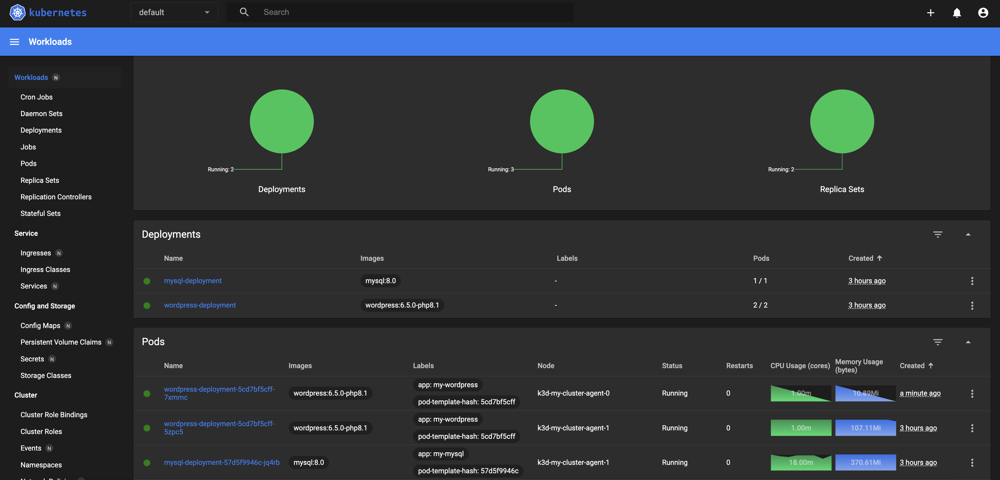

# Kubernetes Dashboard

> [!IMPORTANT]  
> **Goal:** Running Kubernetes Dashboard



---

k3d cluster create my-cluster --servers 1 --agents 1 --port "8888:80@loadbalancer"

## Deploying Kubernetes Dashboard

Apply

```sh
kubectl apply -f https://raw.githubusercontent.com/kubernetes/dashboard/v2.7.0/aio/deploy/recommended.yaml
```

Create `admin_user.yml`

```sh
apiVersion: v1
kind: ServiceAccount
metadata:
  name: admin-user
  namespace: kubernetes-dashboard
---
apiVersion: rbac.authorization.k8s.io/v1
kind: ClusterRoleBinding
metadata:
  name: admin-user
roleRef:
  apiGroup: rbac.authorization.k8s.io
  kind: ClusterRole
  name: cluster-admin
subjects:
  - kind: ServiceAccount
    name: admin-user
    namespace: kubernetes-dashboard
```

Apply

```sh
kubectl apply -f admin_user.yml
```

Proxy

```sh
kubectl proxy 
```

Go to browser:

```sh
http://localhost:8001/api/v1/namespaces/kubernetes-dashboard/services/https:kubernetes-dashboard:/proxy/
```

Get token

```sh
kubectl create token admin-user  --namespace kubernetes-dashboard
```
