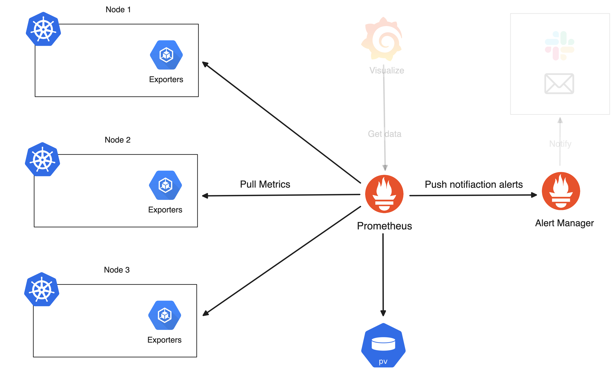
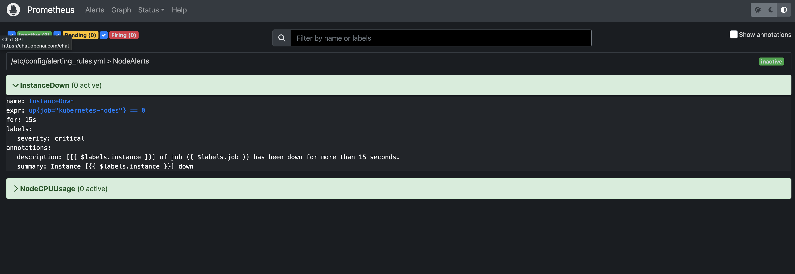
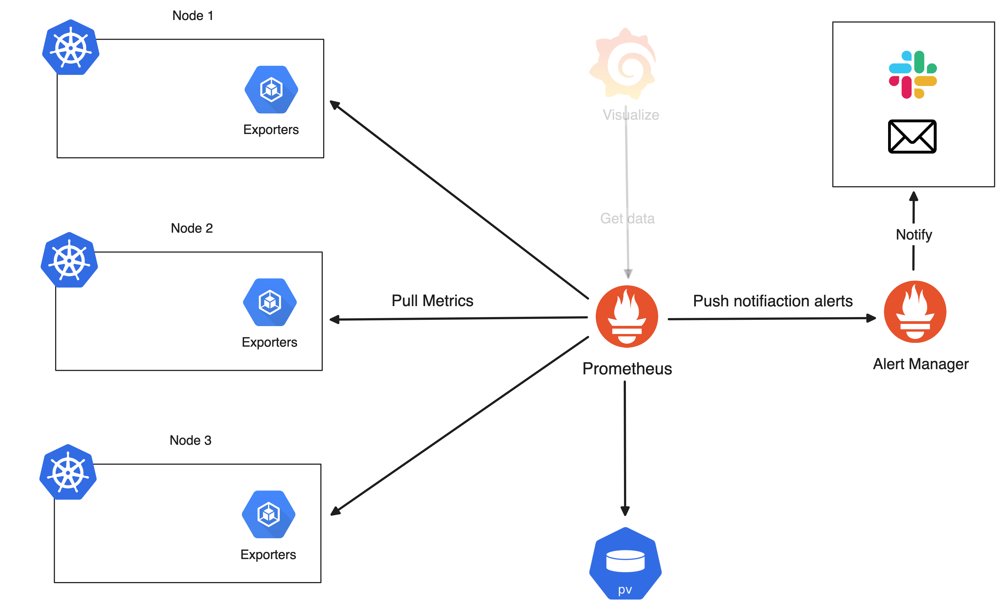

# Prometheus

> [!IMPORTANT]  
> **Goal:** Running Prometheus and setting alert rules

Ref: <https://artifacthub.io/packages/helm/prometheus-community/prometheus>


## Deploying Prometheus

Add repository

```sh
helm repo add prometheus-community https://prometheus-community.github.io/helm-charts
```

Install prometheus with HELM

```sh
helm install my-prometheus prometheus-community/prometheus -n monitoring --create-namespace
```

## Enable ingress

Create `values.yaml`

```sh
server:
  ingress:
    enabled: true
    hosts:
      - prometheus.example.com
```

> Configurations: <https://github.com/helm/charts/blob/master/stable/prometheus/README.md#configuration>

Helm upgrade

```sh
helm upgrade my-prometheus prometheus-community/prometheus -f values.yaml -n monitoring
```

Config host file for domain

```sh
sudo nano /etc/hosts
```

```sh
### add here
127.0.0.1    prometheus.example.com
127.0.0.1    grafana.example.com
```

Go to <http://prometheus.example.com:8888/>

Should be prometheus page

Now diagram is like this:



## Setting Alert rules

Updating `values.yaml`

```sh
server:
  ingress:
    enabled: true
    hosts:
      - prometheus.example.com
serverFiles:         <============================== Add here
  alerting_rules.yml:
    groups:
    - name: NodeAlerts
      rules:
      - alert: InstanceDown
        expr: up{job="kubernetes-nodes"} == 0
        for: 15s
        labels:
          severity: critical
        annotations:
          summary: "Instance [{{ $labels.instance }}] down"
          description: "[{{ $labels.instance }}] of job {{ $labels.job }} has been down for more than 15 seconds."

      - alert: NodeCpuUsage
        expr: (100 - (avg(irate(node_cpu_seconds_total{mode="idle"}[2m])) BY (instance) * 100)) > 80
        for: 2m
        labels:
          severity: warning
        annotations:
          summary: '{{$labels.instance}}: High CPU usage detect'
          description: '{{$labels.instance}}: CPU usage is above 80% (current value is: {{ $value }})'
```

Helm upgrade

```sh
helm upgrade my-prometheus prometheus-community/prometheus -f values.yaml -n monitoring
```

Go to <http://prometheus.example.com:8888/alerts> for check alert rules



Try to add new node

```sh
k3d node create new-agent  --cluster my-cluster 
```

Try to delete new node

```sh
k3d node delete k3d-new-agent-0
```

Get node for check node status

```sh
kubectl get node
```

Go to <http://prometheus.example.com:8888/alerts> and check again

Now diagram is like this:


