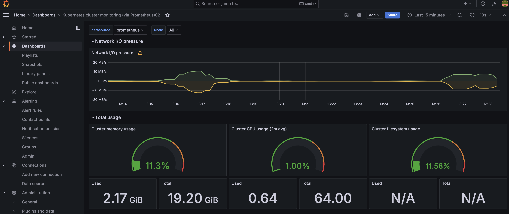
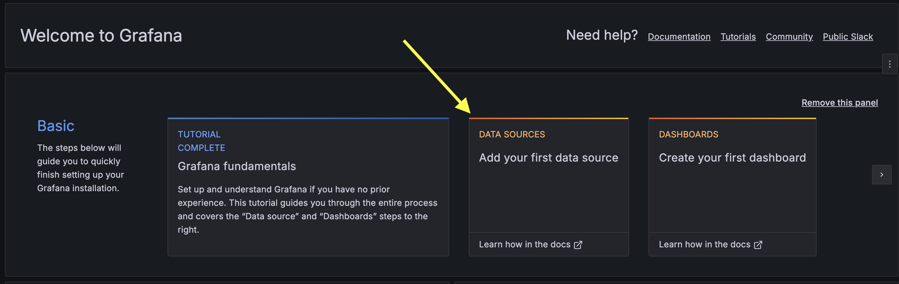
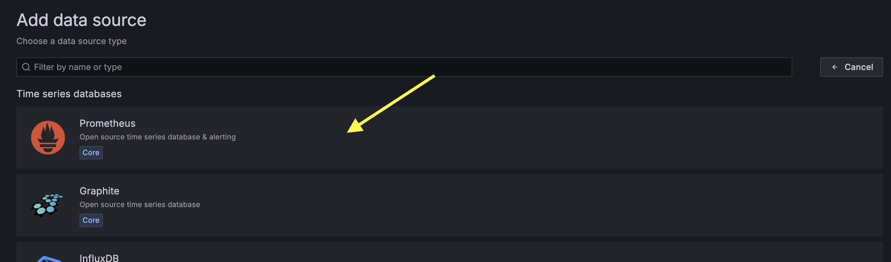
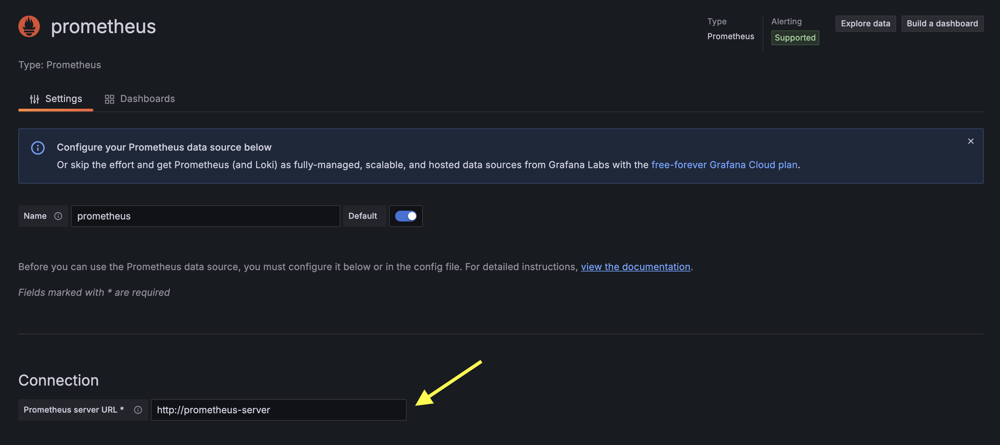
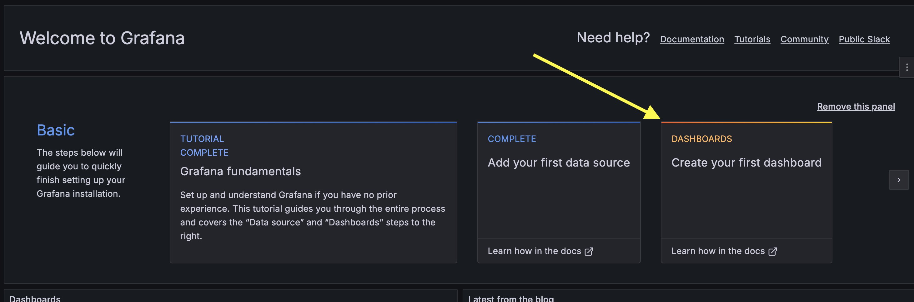
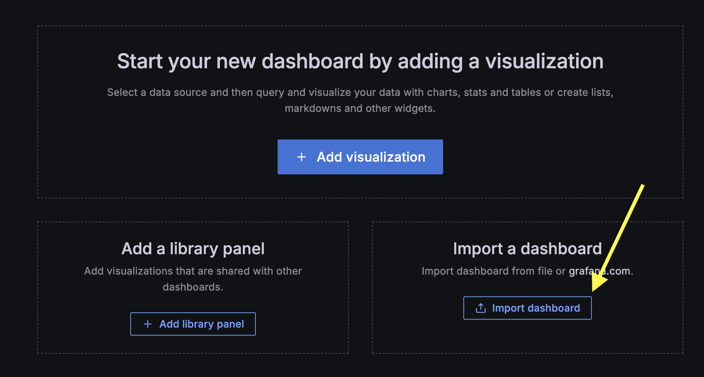
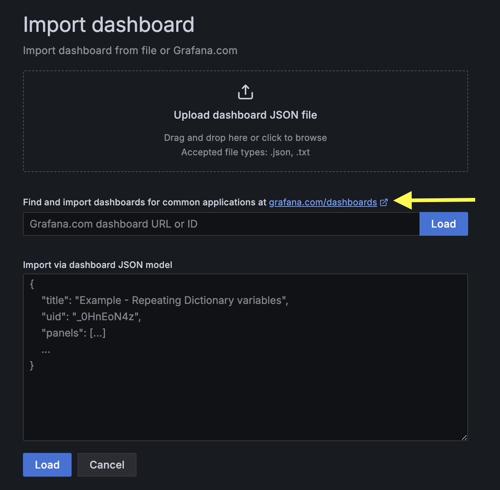
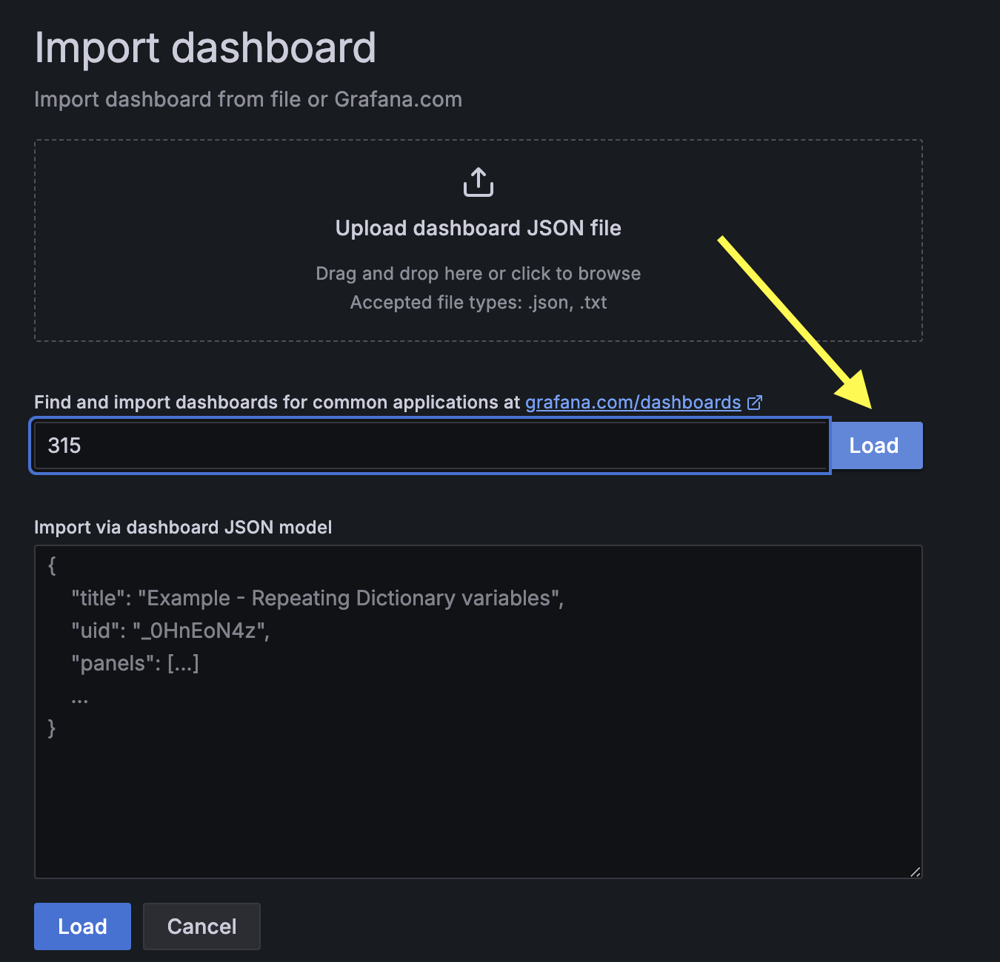
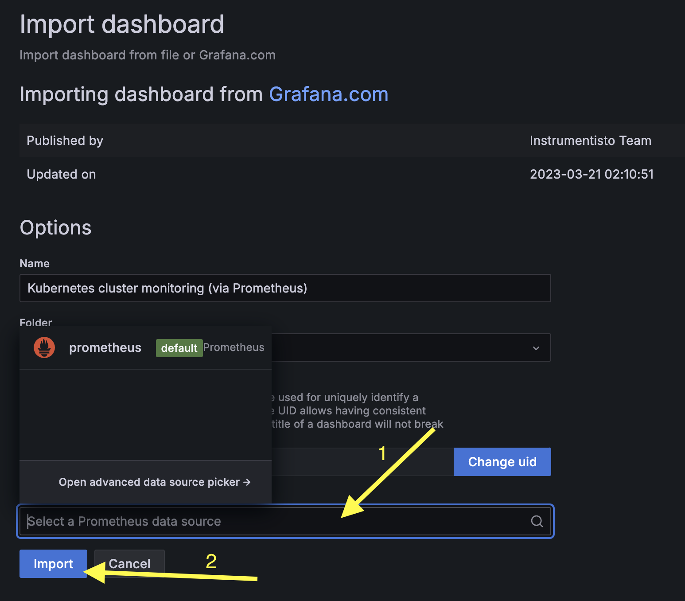
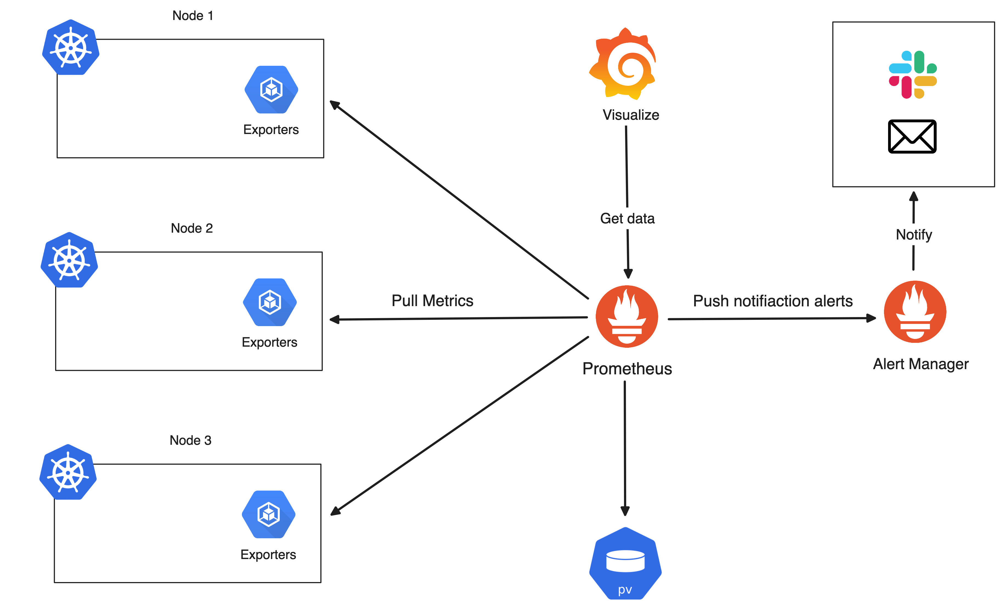

# Grafana

> [!IMPORTANT]  
> **Goal:** Running Grafana with prometheus metric

Ref: <https://artifacthub.io/packages/helm/grafana/grafana>



## Deploying Grafana

Add repository

```sh
helm repo add grafana https://grafana.github.io/helm-charts
```

Install grafana with HELM

```sh
helm install my-grafana grafana/grafana -n monitoring --create-namespace
```

## Enable ingress

Create `values.yaml`

```sh
ingress:
  enabled: true
  hosts:
    - grafana.example.com
```

Helm upgrade

```sh
helm upgrade my-grafana grafana/grafana -f values.yaml -n monitoring
```

Go to <http://grafana.example.com:8888/>

Should be grafana page

## Setup Grafana

### Login

Username: **admin**

Password:

```sh
kubectl get secret my-grafana -n monitoring -o jsonpath="{.data.admin-password}" | base64 -d ; echo
```

### Add datasources



Choose Prometheus


Input prometheus server url as prometheus service's name

```sh
kubectl get service -n monitoring
```

So input `http://my-prometheus-server`


### Add Dashboard



import dashboard


Choose template


Input dashboard id for examples: `315`, `6417`, then click load button


Select prometheus data source and click import button


Should see the dashboard

Now diagram is like this:


