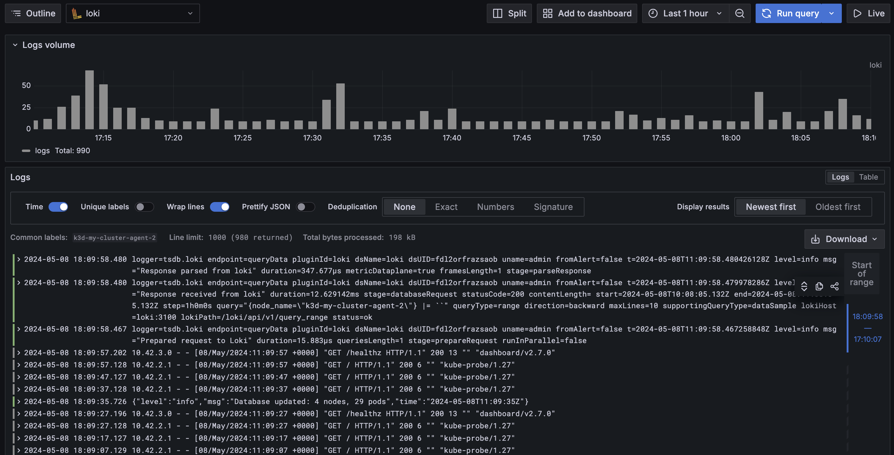
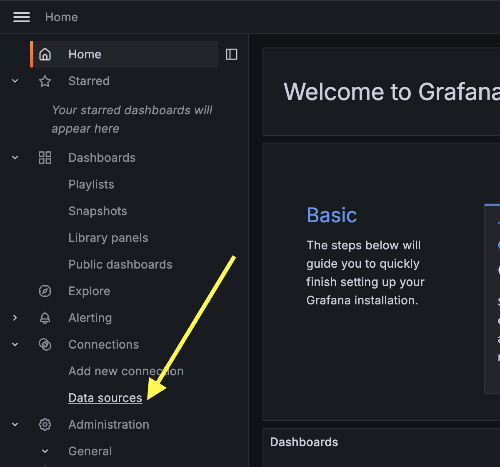
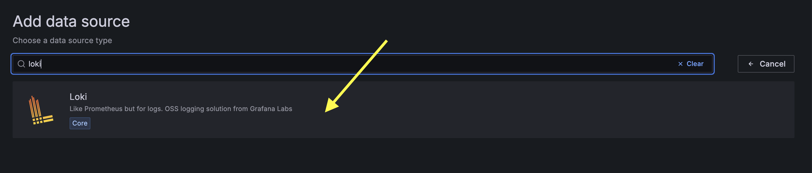
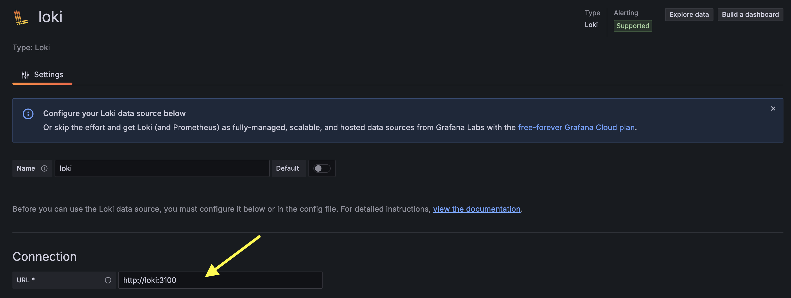
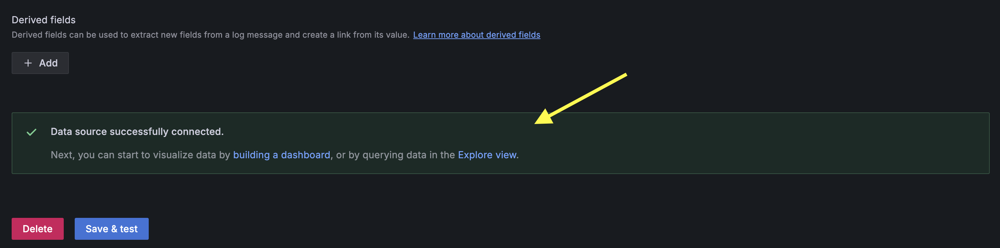
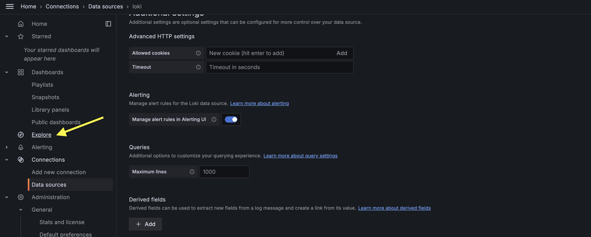
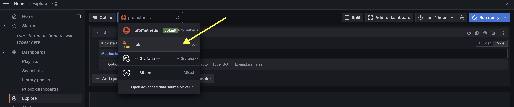
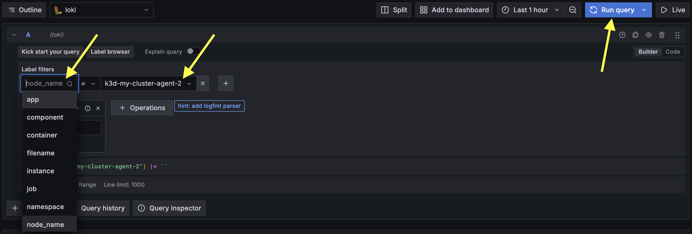

# Logs with Loki

> [!IMPORTANT]  
> **Goal:** Running Grafana with Loki logs

Ref: <https://artifacthub.io/packages/helm/grafana/loki-stack>



## Deploying Loki

Add repository

```sh
helm repo add grafana https://grafana.github.io/helm-charts
```

Install loki with HELM

```sh
helm install my-loki grafana/loki-stack -n monitoring --create-namespace
```

Create `values.yaml`

```sh
loki:
  image:
    repository: grafana/loki
    tag: 2.9.3
```

Helm upgrade

```sh
helm upgrade my-loki grafana/loki-stack -f values.yaml -n monitoring
```

Checking Loki resoures

```sh
kubectl get all -n monitoring
```

## Setup data sources on Grafana

Open Grafana then add datasources


choose Loki


Input loki server url as loki service's name

```sh
kubectl get service -n monitoring
```

So input `http://loki:3100`, Click save&test button


If all work, will be like this


Go to sidebar > Explore


Choose Loki


Choose label filter and run query

