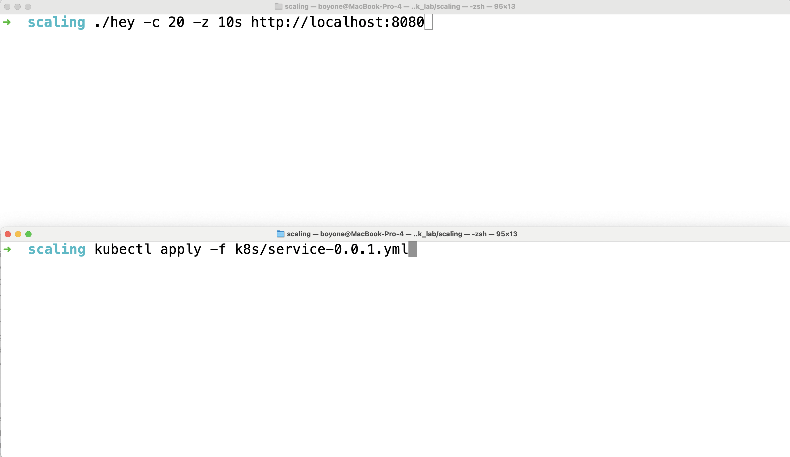
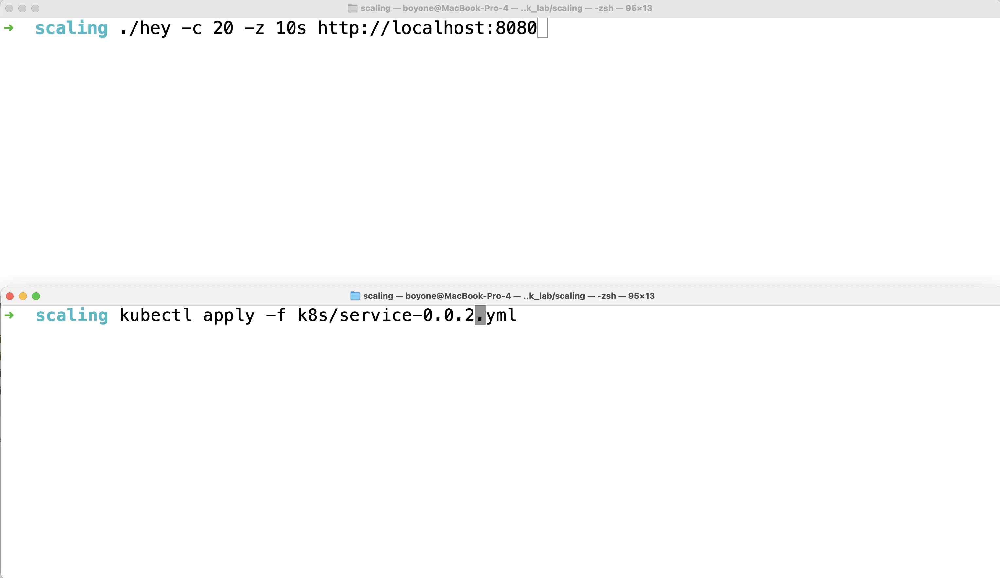

# Readiness and Graceful Shutdown

## Prerequisite

1. [k3d](https://k3d.io/v5.6.3/)
2. [hey](https://github.com/rakyll/hey)
   1. download and rename to `hey`
   2. run command: `chmod +x hey`
3. [docker](https://www.docker.com/)

---

## Getting Start

1. Workspace's skeleton

   ```txt
   readiness-graceful-shutdown
     |-greeting-service
     |-greeting-service-001
     |-greeting-service-002
     |-greeting-service-003
     |-greeting-service-004
     |-k8s
       |-service.yml
       |-service-0.0.1.yml
       |-service-0.0.2.yml
       |-service-0.0.3.yml
       |-service-0.0.4.yml
   ```

2. Open `terminal` and change directory to `readiness-graceful-shutdown`

   ```sh
   cd readiness-graceful-shutdown
   ```

3. Create cluster

   ```sh
   k3d cluster create default -p "8080:8080@loadbalancer" --servers 1 --agents 3
   kubectl get nodes
   ```

   - Delete Cluster `k3d cluster delete default`

4. Build image

   ```sh
   cd greeting-service
   docker build -t greeting-service:0.0.1 .
   k3d image import greeting-service:0.0.1 --cluster default
   docker image ls
   ```

5. Create service & deployment with `apply`

   ```sh
   cd ..
   kubectl apply -f k8s/service.yml
   ```

   ```sh
   kubectl get deployments
   kubectl get pods
   kubectl get service
   ```

6. Test with curl

   ```sh
   curl http://localhost:8080/
   ```

7. Test with `hey`

   ```sh
   ./hey -c 20 -z 10s http://localhost:8080
   ```

### Test Scale-Out without Readiness

1. Change `replicas` from 2 to 3 at `k8s/service.yaml`

   ```yaml
   apiVersion: apps/v1
   kind: Deployment
   metadata:
     labels:
       app: greeting-service
     name: greeting-service
   spec:
     replicas: 3 # change from 2 to 3
     selector:
       matchLabels:
         app: greeting-service
     template:
       metadata:
         labels:
           app: greeting-service
       spec:
         containers:
           - image: greeting-service:0.0.1
             imagePullPolicy: IfNotPresent
             name: greeting-service
   ```

2. Proof scale-out

   

   1. Open new terminal and type following command[`test terminal`]

      ```sh
      ./hey -c 20 -z 10s http://localhost:8080
      ```

   2. Switch to previous terminal then type following command[`apply terminal`]

      ```sh
      kubectl apply -f k8s/service.yml
      ```

   3. Press `enter` on `test terminal` and switch to `apply terminal` immediately then press `enter`

3. Waiting for result

   ```sh
   Error distribution:
   [XXXXX]	Get "http://localhost:8080": EOF
   ```

4. What happens during scale-out?

---

## Add Health Check

1. Change greeting message

   ```java
   @GetMapping("/")
   public String getGreeting() {
       return "Hello, Health Check!";
   }
   ```

2. Change artifact version at `build.gradle` from `'0.0.1'` to version `'0.0.2'`

   ```gradle
   version = '0.0.2'
   ```

3. Add `implementation 'org.springframework.boot:spring-boot-starter-actuator'` to `build.gradle`

   ```gradle
   dependencies {
    implementation 'org.springframework.boot:spring-boot-starter-web'
    implementation 'org.springframework.boot:spring-boot-starter-actuator'
    testImplementation 'org.springframework.boot:spring-boot-starter-test'
    testRuntimeOnly 'org.junit.platform:junit-platform-launcher'
   }
   ```

4. Set exposing the health actuator endpoint

   - Create file `greeting-service/src/main/resources/application.yaml`
   - Add following config

   ```yaml
   server:
     port: 8080
     tomcat:
       connection-timeout: 2s
       keep-alive-timeout: 15s
       threads:
         max: 50
         min-spare: 5

   spring:
     application:
       name: greeting-service

   management:
     endpoints: # exposing the health Actuator endpoint
       web:
       exposure:
         include: health
     endpoint:
       health:
         show-details: always
         show-components: always
         probes:
           enabled: true
   ```

5. Build docker image

   - Change directory to `greeting-service`

   ```sh
   cd greeting-service
   docker build -t greeting-service:0.0.2 .
   docker image ls
   ```

6. Load image to cluster

   ```sh
   k3d image import greeting-service:0.0.2 --cluster default
   ```

7. Change image from `greeting-service:0.0.1` to `greeting-service:0.0.2` and add `livenessProbe` and `readinessProbe` at `service.yml` file

   ```yaml
   spec:
     containers:
       - image: greeting-service:0.0.2
         imagePullPolicy: IfNotPresent
         name: greeting-service
         livenessProbe: # set liveness probe
           httpGet:
             path: /actuator/health/liveness
             port: 8080
           initialDelaySeconds: 10
           periodSeconds: 5
         readinessProbe: # set readiness probe
           httpGet:
             path: /actuator/health/readiness
             port: 8080
           initialDelaySeconds: 5
           periodSeconds: 15
   ```

8. Set replicas to 2 by change `replicas` from 3 to 2 at `k8s/service.yml` then apply

   ```yaml
   apiVersion: apps/v1
   kind: Deployment
   metadata:
     labels:
       app: greeting-service
     name: greeting-service
   spec:
     replicas: 2 # change from 3 to 2
     selector:
       matchLabels:
         app: greeting-service
     template:
       metadata:
         labels:
           app: greeting-service
       spec:
         containers:
           - image: greeting-service:0.0.2
             imagePullPolicy: IfNotPresent
             name: greeting-service
   ```

9. Apply change

   ```sh
   cd ..
   kubectl apply -f k8s/service.yml
   ```

### Test Scale-Out with Readiness

1. Change `replicas` from 2 to 3 at `k8s/service.yml`

   ```yaml
   apiVersion: apps/v1
   kind: Deployment
   metadata:
     labels:
       app: greeting-service
     name: greeting-service
   spec:
     replicas: 3 # change from 2 to 3
     selector:
       matchLabels:
         app: greeting-service
     template:
       metadata:
         labels:
           app: greeting-service
       spec:
         containers:
           - image: greeting-service:0.0.2
             imagePullPolicy: IfNotPresent
             name: greeting-service
   ```

2. Proof scale-out and readiness

   

   1. Open new terminal and type following command[`test terminal`]

      ```sh
      hey -c 20 -z 10s http://localhost:8080
      ```

   2. Switch to previous terminal then type following command[`apply terminal`]

      - `k8s` directory

      ```sh
      kubectl apply -f k8s/service.yaml
      ```

   3. Press `enter` on `test terminal` and switch to `apply terminal` immediately then press `enter`

3. What happens?

4. Check application's health

   ```sh
   curl http://localhost:8080/actuator/health
   curl http://localhost:8080/actuator/health/liveness
   curl http://localhost:8080/actuator/health/readiness
   ```

5. What is liveness and readiness?

|                                                   | Liveness                                                    | Readiness                                                                               |
| :------------------------------------------------ | :---------------------------------------------------------- | :-------------------------------------------------------------------------------------- |
| Semantic meaning                                  | Is the container running?                                   | Is the container ready to receive traffic?                                              |
| Implication of probe failures exceeding threshold | Pod is terminated and replaced.                             | Pod is removed from receiving traffic until the probe passes.                           |
| Time to recover from a failed probe               | Slow: Pod is rescheduled on failure and needs time to boot. | Fast: Pod is already running and can immediately receive traffic once the probe passes. |
| Default state at container boot                   | Passing (live).                                             | Failing (unready).                                                                      |

- from `Wiliam Denniss, Kubernetes for Developers(Manning Publications Co.), p. 80.`

---

## Scale-In

1. Add delay to application

   ```java
   @GetMapping("/")
   public String getGreeting() throws InterruptedException {
       Thread.sleep(3000);
       return "Hello, Health Check!";
   }
   ```

2. Change artifact version at `build.gradle` from `'0.0.2'` to version `'0.0.3'`

   ```gradle
   version = '0.0.3'
   ```

3. Build docker image

   - Change directory to `greeting-service`

   ```sh
   cd greeting-service
   docker build -t greeting-service:0.0.3 .
   docker image ls
   ```

4. Load image to cluster

   ```sh
   k3d image import greeting-service:0.0.3 --cluster default
   ```

5. Change `spec.containers.image` to `greeting-service:0.0.3` and set replicas to 4 at `service.yaml`

   ```yaml
   apiVersion: apps/v1
   kind: Deployment
   metadata:
     labels:
       app: greeting-service
     name: greeting-service
   spec:
     replicas: 4
     selector:
       matchLabels:
         app: greeting-service
     template:
       metadata:
         labels:
           app: greeting-service
       spec:
         containers:
           - image: greeting-service:0.0.3 # set new image
             imagePullPolicy: IfNotPresent
             name: greeting-service
   ```

6. Apply change

   ```sh
   cd ..
   kubectl apply -f k8s/service.yaml
   ```

### Test Scale-In without Graceful Shutdown

1. Change `replicas` from 4 to 2 at `k8s/service.yaml`

   ```yaml
   apiVersion: apps/v1
   kind: Deployment
   metadata:
     labels:
       app: greeting-service
     name: greeting-service
   spec:
     replicas: 2 # change from 4 to 2
     selector:
       matchLabels:
         app: greeting-service
     template:
       metadata:
         labels:
           app: greeting-service
       spec:
         containers:
           - image: greeting-service:0.0.3
             imagePullPolicy: IfNotPresent
             name: greeting-service
   ```

2. Proof scale-in

   

   1. Open new terminal and type following command[`test terminal`]

      ```sh
      hey -c 20 -z 10s http://localhost:8080
      ```

   2. Switch to previous terminal then type following command[`apply terminal`]

      ```sh
      kubectl apply -f k8s/service.yml
      ```

   3. Press `enter` on `test terminal` and switch to `apply terminal` immediately then press `enter`

3. Waiting for result

   ```sh
   Error distribution:
   [XXXXX]	Get "http://localhost:8080": EOF
   ```

4. What happens during scale-in?

---

## Add Graceful Shutdown

1. Change greeting message

   ```java
   @GetMapping("/")
   public String getGreeting() throws InterruptedException {
       Thread.sleep(3000);
       return "Hello, Health Check and Graceful Shutdown!";
   }
   ```

2. Change artifact version at `build.gradle` from `'0.0.3'` to version `'0.0.4'`

   ```gradle
   version = '0.0.4'
   ```

3. add <project>/src/main/resources/application.yaml

   ```yaml
   server:
     port: 8080
     shutdown: graceful # switch to a graceful mode
     tomcat:
       connection-timeout: 2s # default 20s
       keep-alive-timeout: 15s
       threads:
         max: 50
         min-spare: 5

   spring:
     application:
       name: greeting-service
     lifecycle:
       timeout-per-shutdown-phase: 15s # default is 30s
   ```

   - The `server.tomcat.connection-timeout` property defines a limit for how much time Tomcat should wait between accepting a TCP connection from a client and actually receiving the HTTP request.
   - The `server.tomcat.keep-alive-timeout` property defines how long to keep a connection open while waiting for new HTTP requests.
   - The `server.shutdown` property defines shutdown mode. By default, Spring Boot stops the server immediately after receiving a termination signal (`SIGTERM`). You can switch to a graceful mode by configuring the `server.shutdown` property.
   - The `spring.lifecycle.timeout-per-shutdown-phase` properties defines a grace period. By default the grace period is 30 seconds.

4. Build docker image

   - Change directory to `greeting-service`

   ```sh
   cd greeting-service
   docker build -t greeting-service:0.0.4 .
   docker image ls
   ```

5. Load image to cluster

   ```sh
   k3d image import greeting-service:0.0.4 --cluster default
   ```

6. Change `replicas` from 2 to 4 and change image from `greeting-service:0.0.3` to `greeting-service:0.0.4` at `service.yaml`

   ```yaml
   apiVersion: apps/v1
   kind: Deployment
   metadata:
     labels:
       app: greeting-service
     name: greeting-service
   spec:
     replicas: 4 # change from 2 to 4
     selector:
       matchLabels:
         app: greeting-service
     template:
       metadata:
         labels:
           app: greeting-service
       spec:
         containers:
           - image: greeting-service:0.0.4 # change from 0.0.3 to 0.0.4
             imagePullPolicy: IfNotPresent
             name: greeting-service
   ```

7. Apply change

   ```sh
   cd ..
   kubectl apply -f k8s/service.yaml
   ```

### Test Scale-In with Graceful Shutdown

1. Change `replicas` from 4 to 2 at `k8s/service.yml`

   ```yaml
   apiVersion: apps/v1
   kind: Deployment
   metadata:
     labels:
       app: greeting-service
     name: greeting-service
   spec:
     replicas: 2 # change from 4 to 2
     selector:
       matchLabels:
         app: greeting-service
     template:
       metadata:
         labels:
           app: greeting-service
       spec:
         containers:
           - image: greeting-service:0.0.4
             imagePullPolicy: IfNotPresent
             name: greeting-service
   ```

2. Proof scale-in and graceful shutdown

   

   1. Open new terminal and type following command[`test terminal`]

      ```sh
      hey -c 20 -z 10s http://localhost:8080
      ```

   2. Switch to previous terminal then type following command[`apply terminal`]

      - `k8s` directory

      ```sh
      kubectl apply -f service.yaml
      ```

   3. Press `enter` on `test terminal` and switch to `apply terminal` immediately then press `enter`

3. What happens?

---

## Tip set `preStop` at Container's Lifecycle

```yaml
spec:
  containers:
    - image: greeting-service:0.0.4
      imagePullPolicy: IfNotPresent
      name: greeting-service
      lifecycle:
        preStop:
          exec:
            command: ['sh', '-c', 'sleep 5']
```
